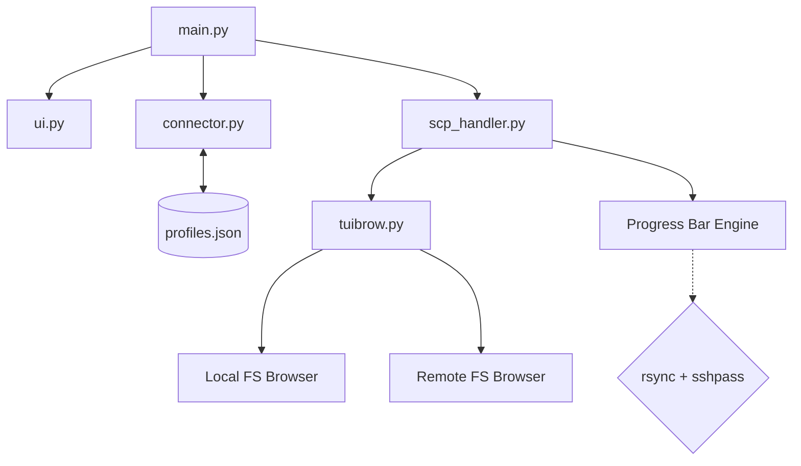

# RSTUI (Rsync TUI)

```
  __________  ___________________ ____ ___ .___ 
  \______   \/   _____/\__    ___/    |   \|   |
   |       _/\_____  \   |    |  |    |   /|   |
   |    |   \/        \  |    |  |    |  / |   |
   |____|_  /_______  /  |____|  |______/  |___|
          \/        \/                             
```

An interactive, high-performance TUI for file transfers using `rsync` with `sshpass`, built in Python.
RSTUI allows you to navigate local and remote filesystems visually and perform delta transfers with real-time progress bars.

---

## Architecture



## Features

- **Interactive TUI file browser** for both local and remote paths.
- **Profile Management:** Save frequently used server connections and load them instantly, currently stored in json 
- **Delta-transfer support** for fast, efficient uploads and downloads.
- **Real-time Progress Bar** (Percentage + Transfer Speed).
- **Password entered once** and reused for the entire session.
- **Visual Folder Selection:** Select destinations without typing long paths.

---

## Requirements

### Local Machine
- Python 3.x
- `rsync`
- `sshpass`

### Remote Machine
- `rsync` (Required for the transfer engine to operate)


### Quick Install (Arch Linux)
```bash
sudo pacman -S rsync sshpass
```

### Quick Install (Ubuntu/Debian)
```bash
sudo apt update && sudo apt install rsync sshpass
```

---

## Usage

1.  Clone the repository:
    ```bash
    git clone https://github.com/RydertHuGlIfE/rstui.git
    cd rstui
    ```
2.  Install dependencies:
    ```bash
    pip install -r requirements.txt
    ```
3.  Run the application:
    ```bash
    python3 main.py
    ```

Currently it only supports macOS and Linux distros, still researching for windows compatiblity layers
---

## Project Structure

```
rstui/
  main.py         Entry point and connection management
  connector.py    SSH connection and terminal UI helpers
  scp_handler.py  Rsync transfer logic and progress parsing
  tuibrow.py      TUI file browser (local and remote)
  ui.py           Branding and ASCII banner
  profiles.json   Local storage for saved server connections
```

---

## License
MIT
