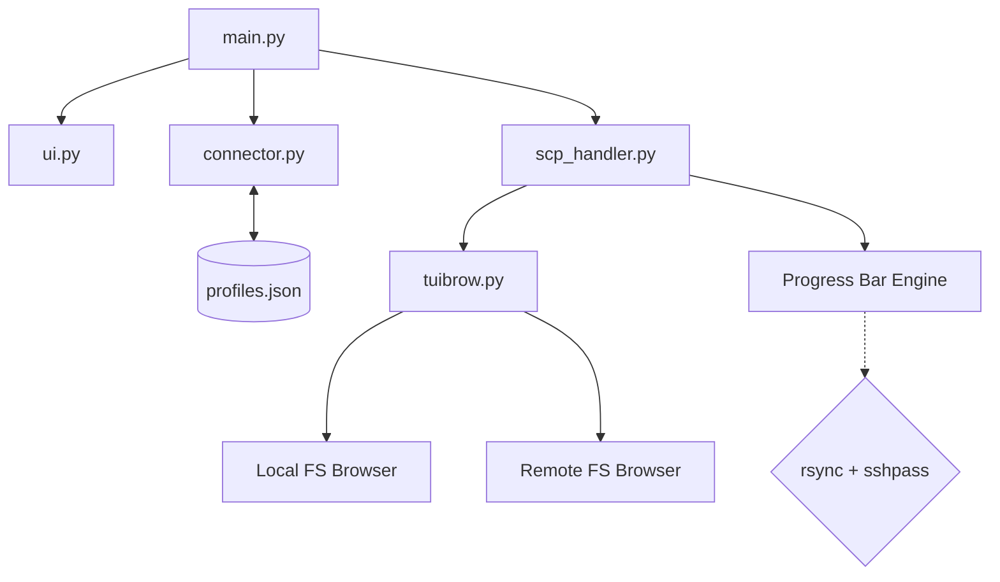

# VELLTUI (Vell TUI)

```
____   ____     .__  ._________________ ___.___ 
\   \ /   /____ |  | |  \__    ___/    |   \   |
 \   Y   // __ \|  | |  | |    |  |    |   /   |
  \     /\  ___/|  |_|  |_|    |  |    |  /|   |
   \___/  \___  >____/____/____|  |______/ |___|
              \/                                
```

VellTUI is currently in alpha development  starting as a high-performance Python TUI for rsync file transfers . Our ultimate vision is to expand it into a complete remote server command center  integrating full system administration  process management with tools like btop  and remote execution capabilities.
---

## Architecture



## Features

- **Interactive TUI file browser** for both local and remote paths.
- **Profile Management:** Save frequently used server connections and load them instantly, currently stored in json 
- **Delta-transfer support** for fast, efficient uploads and downloads.
- **Real-time Progress Bar** (Percentage + Transfer Speed).
- **Password entered once** and reused for the entire session.
- **Visual Folder Selection:** Select destinations without typing long paths.
- **System Monitoring:** Added System Monitoring using btop, provided that btop is installed on the remote server.
- **Remote Shell:** Added Remote Shell using zsh, provided that zsh is installed on the remote server.

---

## Requirements

### Local Machine
- Python 3.x
- `rsync`
- `sshpass`

### Remote Machine
- `rsync` (Required for the transfer engine to operate)


### Quick Install (Arch Linux)
```bash
sudo pacman -S rsync sshpass zsh btop 
```

### Quick Install (Ubuntu/Debian)
```bash
sudo apt update && sudo apt install rsync sshpass zsh btop
```

---

## Usage

1.  Clone the repository:
    ```bash
    git clone https://github.com/RydertHuGlIfE/velltui.git
    cd velltui
    ```
2.  Install dependencies:
    ```bash
    pip install -r requirements.txt
    ```
3.  Run the application:
    ```bash
    python3 main.py
    ```

Currently it only supports macOS and Linux distros, still researching for windows compatiblity layers
---

Feel free to contribute to the project, I would love to make it a widely used tool....

## Project Structure

```
velltui/
  main.py         Entry point and connection management
  connector.py    SSH connection and terminal UI helpers
  scp_handler.py  Rsync transfer logic and progress parsing
  tuibrow.py      TUI file browser (local and remote)
  ui.py           Branding and ASCII banner
  profiles.json   Local storage for saved server connections
```

---

## License
MIT
