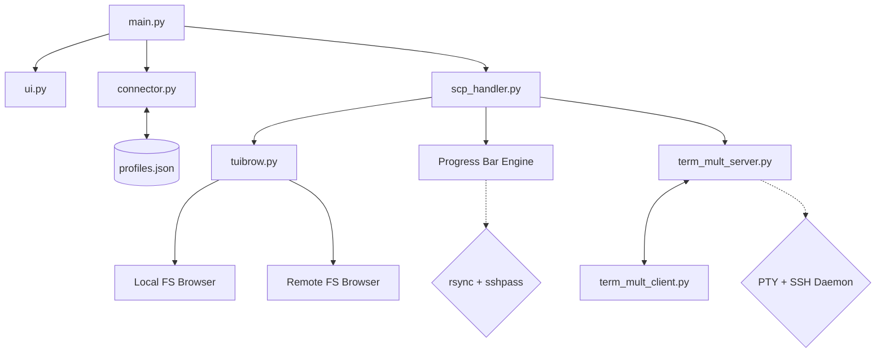

# VELLTUI (Vell TUI)

```
____   ____     .__  ._________________ ___.___ 
\   \ /   /____ |  | |  \__    ___/    |   \   |
 \   Y   // __ \|  | |  | |    |  |    |   /   |
  \     /\  ___/|  |_|  |_|    |  |    |  /|   |
   \___/  \___  >____/____/____|  |______/ |___|
              \/                                
```

VellTUI is currently in alpha development, starting as a high-performance Python TUI for rsync file transfers. Our ultimate vision is to expand it into a complete remote server command center integrating full system administration, process management, and remote execution capabilities.

---

## Architecture



---

## Features

- **Interactive TUI file browser** for both local and remote paths.
- **Profile Management:** Save frequently used server connections and load them instantly.
- **Delta-transfer support** for fast, efficient uploads and downloads.
- **Real-time Progress Bar** (Percentage + Transfer Speed).
- **Password entered once** and reused for the entire session.
- **System Monitoring:** Using btop on the remote server.
- **Remote Shell:** Interactive zsh/bash shell on the remote server.
- **Docker Control:** Manage containers via docker commands.
- **Neo-vim viewer:** Browse and view remote files with nvim.
- **Disk Usage Analyzer:** Interactive `du`-based tool to drill into the file system.
- **Systemd Service Manager:** List, restart, stop, and check status of remote services.
- **Persistent Shell:** Daemon-backed SSH session that survives terminal close — reconnect anytime and your processes are still running.

---

## Persistent Shell

The persistent shell is a custom tmux-like implementation built into VellTUI. It runs a daemonized SSH PTY server on your local machine that keeps the remote shell alive even after you close your terminal.

**How it works:**
- A double-fork daemon (fully detached from your terminal's process group) manages the SSH PTY
- The SSH session is spawned once and persists across client connects/disconnects
- Multiple named sessions per host are supported — each runs independently

**Usage:**
```
Menu → 12. Persistent Shell

--- Persistent Sessions for 192.168.x.x ---
  1: training   (alive)
  2: scraper    (alive)
  3: Create New Session
```

- Pick an existing session to reconnect
- Create a new named session for a new independent shell

**Sessions are stored as Unix sockets:** `/tmp/velltui_{host}_{name}.sock`

---

## Requirements

### Local Machine
- Python 3.x
- `rsync`
- `sshpass`

### Remote Machine
- `rsync` (required for transfers)

### Quick Install (Arch Linux)
```bash
sudo pacman -S rsync sshpass zsh btop
```

### Quick Install (Ubuntu/Debian)
```bash
sudo apt update && sudo apt install rsync sshpass zsh btop
```

---

## Usage

1. Clone the repository:
    ```bash
    git clone https://github.com/RydertHuGlIfE/velltui.git
    cd velltui
    ```
2. Install dependencies:
    ```bash
    pip install -r requirements.txt
    ```
3. Run the application:
    ```bash
    python3 main.py
    ```

Currently supports macOS and Linux. Windows compatibility is still being researched.

---

## Project Structure

```
velltui/
  main.py               Entry point and connection management
  connector.py          SSH connection and profile helpers
  scp_handler.py        Rsync transfer logic, progress parsing, persistent shell
  tuibrow.py            TUI file browser (local and remote)
  extrafet.py           Advanced remote features (Docker, Systemd, Disk Analysis)
  term_mult_server.py   Persistent shell daemon — manages SSH PTY over Unix socket
  term_mult_client.py   Persistent shell client — raw-mode terminal relay
  ui.py                 Branding and ASCII banner
  profiles.json         Local storage for saved server connections
```

---

## License
MIT
